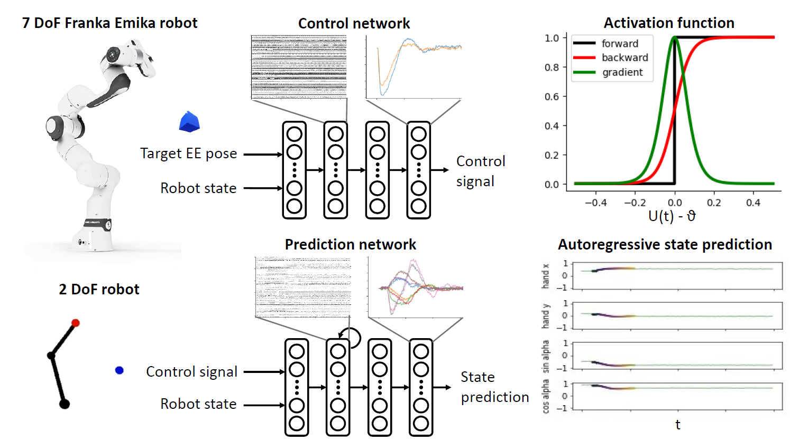
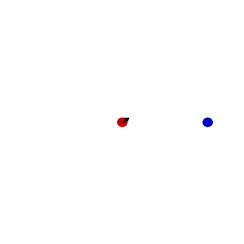
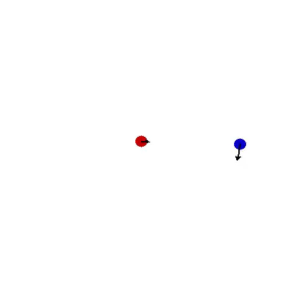
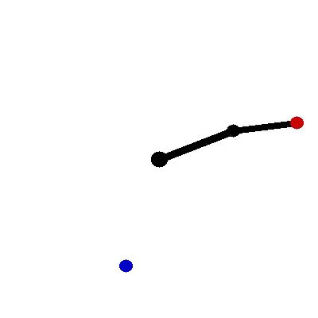
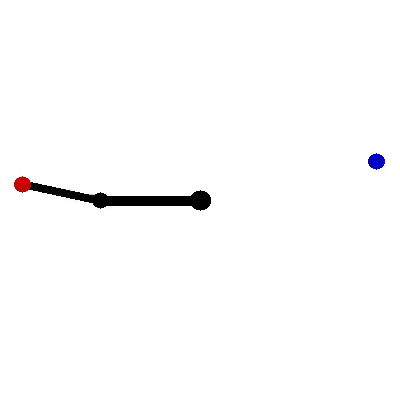
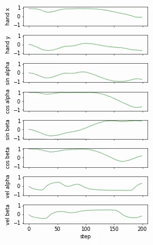

### Spiking Control
This work is developed by Justus Huebotter in 2022 and 2023 as part of the <a href="https://spikeference.eu/">SPIKEFERENCE project</a>, co-founded by the Human Brain Project (HBP) Specific Grant Agreement 3 (ID: 945539) and the Donders Institute for Brain, Cognition and Behaviour. 

In this project, we revisit policy optimization for low-level continuous control tasks with spiking neural networks. In particular, we use prediction errors to learn the dynamics of the system in a recurrent *transition model*. We show that we can then use this model to  drive the learning of an amortized *policy model* for goal reaching by imagining state trajectory rollouts, even when interaction with the real environment is limited.




The exact method used in this code base is explained in more detail in:

J. Huebotter, S. Thill, M. van Gerven, P. Lanillos (2022): **Learning Policies for Continuous Control via Transition Models**, *3rd International Workshop on Active Inference* 

This publication is also available [here](https://arxiv.org/abs/2209.08033).

### Using the code

To use the code please clone this repo and install the required packages. We suggest using a separate environment for this.

```
git clone https://github.com/jhuebotter/spiking_control.git
cd spiking_control
pip install -r requirements.txt
```

To build spiking neural networks we use the [control stork](https://github.com/jhuebotter/control_stork) framework, which extends pytorch with the respective classes and functions. Please also install this locally.

```
git clone https://github.com/jhuebotter/control_stork.git
cd control_stork
pip install -r requirements.txt
pip install -e .
```

For traceability and reproducibility we use [Hydra](https://hydra.cc/) to keep track of experiment settings and logging. The parameters for the experiments can be changed in the `conf` folder. 

To keep track of experiments we use [Weights & Biases](https://wandb.ai). If you would like to use this feature please make sure you have an account set up and the config flag set to `wandb = true` in the `config.yaml` file (true by default). You may have to set the required local variables by calling (more information in the official docs).

```
wandb login
```

The environments that are currently supported are: 
- `plane`             --> acceleration or velocity control
- `reacher`           --> acceleration or velocity control

Added at a later point:
- `franka`            --> torque, acceleration, velocity, or position control

Please see below for example results for both environments with either static or moving targets.

### Example Results

#### Continuous control in a planar linear environment

  

#### Continuous control of a planar robot arm

 

The auto-regressive prediction model learns to accurately forecast the state trajectory based on control inputs:


